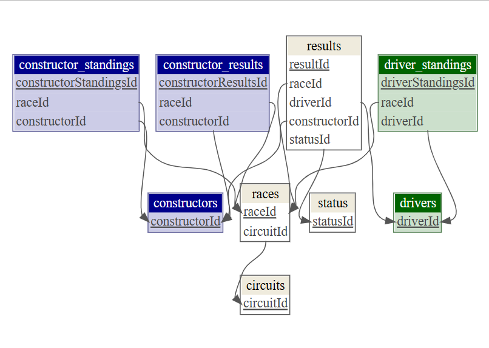

```{r setup, include=FALSE}
knitr::opts_chunk$set(echo = TRUE)
```

```{r, echo=FALSE}
# Load data from global environment :
#load("fulldata.RData")

# To increase the speed of the rendering, we only run the "Formula1" code separately,
# and use the variables stored in the global environment.
# This also allows to reduce the size of the Rmd file by moving as much code as possible to the R file.
# To be able to access the variables, the markdown code should be run in the console :
#
# rmarkdown::render("Formula1.Rmd")
#
# The other option is to include the script in this file by removing the comment of the line below :
#
# source("Formula1.R")
#
```

\begin{center}
\vspace*{\fill}

\includegraphics[width=0.2\textwidth]{images/flag.png}

\vspace*{\fill}
\end{center}

\newpage

\tableofcontents

\newpage

# 1. Introduction

When posed the question, "Who is or was the best Formula 1 driver of all time?" an AI agent will likely first mention **Lewis Hamilton**, followed by **Michael Schumacher**, based primarily on their respective world championship titles. If asked for a list of top drivers, it might also include **Juan Manuel Fangio**, **Alain Prost**, **Max Verstappen**, and **Sebastian Vettel**, arranged alphabetically. **Fangio** stands out with five championships, while the others each have four.

Interestingly, many fans regard **Ayrton Senna**, with his three titles, as a superior driver compared to **Alain Prost**, despite the latter's four championships. This raises the question: how significant are titles in evaluating a driver’s greatness? Should we consider alternative criteria for determining who truly excels?

If we delve deeper, **Juan Manuel Fangio** won five titles in the 1950s, during the formative years of the Formula 1 World Championship. His legacy is so profound that his name has become synonymous with exceptional driving. In French-speaking regions, the phrase "driving like Fangio" denotes flawless driving. A notable reference appears in *The Adventures of Tintin: The Calculus Affair* [1], where a character remarks, "This must be Fangio at the wheel" as a car skillfully avoids a net, reflecting Fangio's prowess during the height of his career. (In the English edition, it is translated as *"They must have a Jack Brabham at the wheel!"*)

```{r, echo=FALSE, fig.cap="\\textit{\"This must be Fangio at the wheel!\"}", fig.align='center', out.width='70%'}
knitr::include_graphics("images/tintin.png")
```

Complicating matters further, the rules of Formula 1 have evolved significantly over the years. The number of races has increased (from seven during Fangio's era to 22 today), and the points system has undergone various changes. For instance, the winner received 8 points until **1960**, then 9 points until **1990**, followed by 10 points until **2009**, and has been set at 25 points since **2010**. Additionally, until **1990**, only the best results counted towards the championship, which allowed Senna to secure the title in **1990** against Prost, despite the latter having more points overall; under modern rules, Prost would have been awarded the title instead.

Ultimately, it is evident that even the most skilled drivers depend significantly on their cars' performance. Both Alain Prost in **1991** and Lewis Hamilton in **2025** encountered substantial difficulties while driving for Ferrari, so much so that Prost was dismissed from his team after comparing his car to a "truck." This raises an important question: to what extent is a world title attributable to the car, and how much is a reflection of the driver's ability?

\newpage

# 2. Dataset

## 2.1 Source

The Formula 1 data, including information on drivers, teams, qualifications, and results, is readily available online, such as on Wikipedia [2]. However, for research purposes, a well-maintained dataset may be more valuable. A suitable dataset can be found on Kaggle [3], although accessing it requires an account that some users may not possess. A publicly accessible version of this dataset is also available on GitHub Training Insights, but to guarantee its ongoing accessibility, I have uploaded a copy to my GitHub repository [4]. This redundancy will ensure that the dataset remains available even if the original site removes it.

## 2.2 Files

The dataset is organized as nineteen different files : 18 comma-separated value files and a json file. We will only use the 9 files below :

```{r, echo=FALSE}
library(kableExtra)
dataset_files <- data.frame(
  icons = c(
    "\\includegraphics[width=0.5cm]{images/file-csv.png}",
    "\\includegraphics[width=0.5cm]{images/file-csv.png}",
    "\\includegraphics[width=0.5cm]{images/file-csv.png}",
    "\\includegraphics[width=0.5cm]{images/file-csv.png}",
    "\\includegraphics[width=0.5cm]{images/file-csv.png}",
    "\\includegraphics[width=0.5cm]{images/file-csv.png}",
    "\\includegraphics[width=0.5cm]{images/file-csv.png}",
    "\\includegraphics[width=0.5cm]{images/file-csv.png}",
    "\\includegraphics[width=0.5cm]{images/file-csv.png}"
  ),
  filename = c(
    "circuits.csv",
    "constructor\\_results.csv",
    "constructor\\_standings.csv",
    "constructors.csv",
    "driver\\_standings.csv",
    "drivers.csv",
    "races.csv",
    "results.csv",
    "status.csv"
  ),
  stringsAsFactors = FALSE
)

kbl(dataset_files, format = "latex", booktabs = TRUE, linesep = "", escape = FALSE, col.names = c("", "Dataset Files")) %>%
  kable_styling(font_size = 9, latex_options = c("hold_position"))
```

The other files listed below aren't relevant for this study :

```{r, echo=FALSE}
#library(kableExtra)
dataset_file_others <- data.frame(
  icons = c(
    "\\includegraphics[width=0.5cm]{images/file-csv.png}",
    "\\includegraphics[width=0.5cm]{images/file-csv.png}",
    "\\includegraphics[width=0.5cm]{images/file-csv.png}",
    "\\includegraphics[width=0.5cm]{images/file-csv.png}",
    "\\includegraphics[width=0.5cm]{images/file-csv.png}",
    "\\includegraphics[width=0.5cm]{images/file-csv.png}",
    "\\includegraphics[width=0.5cm]{images/file-csv.png}",
    "\\includegraphics[width=0.5cm]{images/file-csv.png}",
    "\\includegraphics[width=0.5cm]{images/file-csv.png}",
    "\\includegraphics[width=0.5cm]{images/file-csv.png}"
  ),
  filename = c(
    "fatal\\_accidents\\_drivers.csv",
    "fatal\\_accidents\\_marshalls.csv",
    "lap\\_times.csv",
    "pit\\_stops.csv",
    "qualifying.csv",
    "red\\_flags.csv",
    "safety\\_cars.csv",
    "seasons.csv",
    "sprint\\_results.csv",
    "virtual\\_safety\\_car\\_estimates.json"
  ),
  stringsAsFactors = FALSE
)

kbl(dataset_file_others, format = "latex", booktabs = TRUE, linesep = "", escape = FALSE, col.names = c("", "Dataset Files")) %>%
  kable_styling(font_size = 9, latex_options = c("hold_position"))
```

## 2.3 Tables

### 2.3.1 `circuits.csv`

This file contains information about each circuit where a Formula 1 race has been held.

| Column | Description |
|---|---|
| `circuitId` | Unique identifier for each circuit |
| `circuitRef` | A short reference name for the circuit |
| `name` | The official name of the circuit |
| `location` | The city where the circuit is located |
| `country` | The country where the circuit is located |
| `lat` | Latitude of the circuit |
| `lng` | Longitude of the circuit |
| `alt` | Altitude of the circuit in meters |
| `url` | URL for the circuit's Wikipedia page |

### 2.3.2 `constructor_results.csv`

This file contains the results for each constructor in each race.

| Column | Description |
|---|---|
| `constructorResultsId` | Unique identifier for each constructor result |
| `raceId` | Foreign key to `races.csv` |
| `constructorId` | Foreign key to `constructors.csv` |
| `points` | Points scored by the constructor in the race |
| `status` | Status of the constructor in the race |

### 2.3.3 `constructor_standings.csv`

This file contains the constructor standings after each race.

| Column | Description |
|---|---|
| `constructorStandingsId` | Unique identifier for each constructor standing |
| `raceId` | Foreign key to `races.csv` |
| `constructorId` | Foreign key to `constructors.csv` |
| `points` | Total points for the constructor after the race |
| `position` | Constructor's position in the standings |
| `positionText` | Text representation of the constructor's position |
| `wins` | Number of wins for the constructor in the season |

\newpage

### 2.3.4 `constructors.csv`

This file contains information about each constructor.

| Column | Description |
|---|---|
| `constructorId` | Unique identifier for each constructor |
| `constructorRef` | A short reference name for the constructor |
| `name` | The full name of the constructor |
| `nationality` | The nationality of the constructor |
| `url` | URL for the constructor's Wikipedia page |

### 2.3.5 `driver_standings.csv`

This file contains the driver standings after each race.

| Column | Description |
|---|---|
| `driverStandingsId` | Unique identifier for each driver standing |
| `raceId` | Foreign key to `races.csv` |
| `driverId` | Foreign key to `drivers.csv` |
| `points` | Total points for the driver after the race |
| `position` | Driver's position in the standings |
| `positionText` | Text representation of the driver's position |
| `wins` | Number of wins for the driver in the season |

### 2.3.6 `drivers.csv`

This file contains information about each driver.

| Column | Description |
|---|---|
| `driverId` | Unique identifier for each driver |
| `driverRef` | A short reference name for the driver |
| `number` | The driver's car number |
| `code` | A three-letter code for the driver |
| `forename` | The driver's first name |
| `surname` | The driver's last name |
| `dob` | The driver's date of birth |
| `nationality` | The driver's nationality |
| `url` | URL for the driver's Wikipedia page |

\newpage

### 2.3.7 `races.csv`

This file contains information about each race.

| Column | Description |
|---|---|
| `raceId` | Unique identifier for each race |
| `year` | The year of the race |
| `round` | The round number of the race in the season |
| `circuitId` | Foreign key to `circuits.csv` |
| `name` | The name of the Grand Prix |
| `date` | The date of the race |
| `time` | The time of the race |
| `url` | URL for the race's Wikipedia page |
| `fp1_date` | Date of Free Practice 1 |
| `fp1_time` | Time of Free Practice 1 |
| `fp2_date` | Date of Free Practice 2 |
| `fp2_time` | Time of Free Practice 2 |
| `fp3_date` | Date of Free Practice 3 |
| `fp3_time` | Time of Free Practice 3 |
| `quali_date` | Date of Qualifying |
| `quali_time` | Time of Qualifying |
| `sprint_date` | Date of Sprint Race |
| `sprint_time` | Time of Sprint Race |

### 2.3.8 `results.csv`

This file contains the results for each driver in each race.

| Column | Description |
|---|---|
| `resultId` | Unique identifier for each result |
| `raceId` | Foreign key to `races.csv` |
| `driverId` | Foreign key to `drivers.csv` |
| `constructorId` | Foreign key to `constructors.csv` |
| `number` | The driver's car number |
| `grid` | The driver's starting grid position |
| `position` | The driver's finishing position |
| `positionText` | Text representation of the driver's finishing position |
| `positionOrder` | The driver's finishing position in order |
| `points` | Points scored by the driver in the race |
| `laps` | Number of laps completed by the driver |
| `time` | The driver's total race time |
| `milliseconds` | The driver's total race time in milliseconds |
| `fastestLap` | The lap number of the driver's fastest lap |
| `rank` | The rank of the driver's fastest lap |
| `fastestLapTime` | The driver's fastest lap time |
| `fastestLapSpeed` | The speed of the driver's fastest lap |
| `statusId` | Foreign key to `status.csv` |

\newpage

### 2.3.9 `status.csv`

This file contains information about the finishing status of a driver in a race.

| Column | Description |
|---|---|
| `statusId` | Unique identifier for each status |
| `status` | A description of the finishing status |

## 2.4 Entity Relationship Diagram Model

```{r, echo=FALSE, message=FALSE, out.width='80%', fig.align="center", fig.cap = "Entity Relationship Diagram Model"}

```

\newpage

## 2.5 Data Issues

The following figure show that 14 rows in the **driver_standing** table have a position different to the positionText, with only one being "D" (which seems to be for Disqualified) :

```{r, echo=FALSE}
ds <- as_tibble(read.csv("data/driver_standings.csv")) %>% filter(position != positionText)

kbl(ds, format = "latex", booktabs = TRUE, linesep = "") %>%
  kable_styling(font_size = 9, latex_options = c("hold_position"))
```

The raceId 223 and driverId 30 correspond to Michael Schumacher who was disqualified after the Grand Prix of Europe in 1997 :

```{r, echo=FALSE}
ds <- bind_cols(
  races %>% filter(raceId == "223") %>% select(raceId, year, name),
  drivers %>% filter(driverId == "30") %>% select(driverId, forename, surname))

kbl(ds, format = "latex", booktabs = TRUE, linesep = "") %>%
  kable_styling(font_size = 9, latex_options = c("hold_position"))
```

However this wasn't the only disqualification from the history of Formula 1. The table below shows 5 rows from the results table containing 151 observations related to a disqualification (statusId of 2) :

```{r, echo=FALSE}
ds <- results %>%
  filter(statusId == 2) %>%
  select(-number, -time, -milliseconds, -fastestLap, -rank, -fastestLapTime, -fastestLapSpeed) %>%
  head()

kbl(ds, format = "latex", booktabs = TRUE, linesep = "") %>%
  kable_styling(font_size = 9, latex_options = c("hold_position"))
```

More interestingly, the raceId 223 and driverId 30 from the results dataset don't indicate a disqualification but a collision :

```{r, echo=FALSE}
ds <- status %>%
  filter(statusId == results %>% filter(raceId == 223 & driverId == 30) %>% pull(statusId))

kbl(ds, format = "latex", booktabs = TRUE, linesep = "") %>%
  kable_styling(font_size = 9, latex_options = c("hold_position"))
```

\newpage

Now if we look at fatal accidents (statusId = 104), we can only find 3 results :

```{r, echo=FALSE}
df <- results %>%
  filter(statusId == 104) %>%
  left_join(races, by = "raceId") %>%
  left_join(drivers, by = "driverId") %>%
  left_join(status, by = "statusId") %>%
  select(resultId, grid, positionOrder, laps, statusId, year, name, forename, surname, status)

kbl(df, format = "latex", booktabs = TRUE, linesep = "") %>%
  kable_styling(font_size = 9, latex_options = c("hold_position"))
```

We know that more drivers died during a Formula 1 Grand Prix.

For example Ayrton Senna's status in the 1994 San Marin GP was marked as accident (statusId = 3) :

```{r, echo=FALSE}
df <- results %>%
  left_join(races, by = "raceId") %>%
  left_join(drivers, by = "driverId") %>%
  left_join(status, by = "statusId") %>%
  filter(forename == "Ayrton" & surname == "Senna" & year == 1994 & name == "San Marino Grand Prix") %>%
  select(resultId, grid, positionOrder, laps, statusId, year, name, forename, surname, status)

kbl(df, format = "latex", booktabs = TRUE, linesep = "") %>%
  kable_styling(font_size = 9, latex_options = c("hold_position"))
```

Which can indicate that the fatal accidents only report drivers who died on-site during a race or qualifications.

The following table shows a list of statuses, only the first 12 are displayed :

```{r, echo=FALSE}
ds <- head(status, 12)

kbl(ds, format = "latex", booktabs = TRUE, linesep = "") %>%
  kable_styling(font_size = 9, latex_options = c("hold_position"))
```

We will only want to have the following statuses : "Finished", "Abandoned", "Lapsed" and "Disqualified". The "Lapsed" meaning the driver finished the race but with 1 or more laps behind the winner. The "Abandoned" includes all sort of mechanical problems and collisions, accidents... The "Disqualified" status is the same as "Abandoned" but the driver then didn't score any point.

The only exception found is Stirling Moss during the 1959 French GP who scored one point (best lap). He was disqualified during the race and kept his only point for the best lap :

```{r, echo=FALSE}
ds <- results %>%
  filter(points > 0) %>%
  filter(statusId == 2) %>%
  left_join(races, by = "raceId") %>%
  left_join(drivers, by = "driverId") %>%
  left_join(status, by = "statusId") %>%
  select(resultId, points, year, name, forename, surname, status)

kbl(ds, format = "latex", booktabs = TRUE, linesep = "") %>%
  kable_styling(font_size = 9, latex_options = c("hold_position"))
```

\newpage

# 3. Data Transformation

We will now preprocess the Formula 1 dataset, focusing on optimizing the data frames for analysis by removing unnecessary columns, joining relevant data, renaming columns for clarity, and calculating driver age.

## 3.1 Removing Unnecessary Columns

To streamline the dataset, unnecessary columns from various data frames are removed. The goal is to retain only relevant information that will contribute to the overall analysis.

**Circuits:** The columns lat, lng, and url are omitted from the circuits data frame as they do not provide essential information for the analysis of race results.

**Constructor Results & Standings:** In the constructor_results and constructor_standings data frames, the status and positionText columns are excluded, respectively, as they are not required for further analysis.

**Drivers' Columns:** Columns related to drivers, such as number and url in the drivers data frame, are removed from driver_standings, simplifying the dataset.

**Races Table:** The races data frame is streamlined to include only the columns raceId, year, round, circuitId, name, and date, ensuring relevant race information is retained while discarding less useful details.

**Results' Columns:** A significant reduction in the results data frame is performed by dropping columns such as number, time, milliseconds, as well as fastest lap information (fastestLap, fastestLapTime, fastestLapSpeed), which may not be needed for the analysis of race outcomes.

## 3.2 Modifying statuses

As noted in the previous section, the status table includes various statuses that may not be relevant to this study. We will update these to reflect more accurate values.

## 3.3 Joining Tables

To create a comprehensive Formula 1 dataset, the results data frame is merged with several other data frames using left joins based on common identifiers.

The results data frame is join together with races, drivers, constructors, and status, linking them through raceId, driverId, constructorId, and statusId, respectively. This process allows for the integration of race and participant information into a single dataset.

## 3.4 Finalizing the Dataset

After merging the data frames, additional columns that are no longer necessary (raceId, driverId, constructorId, circuitId) are excluded to reduce clutter in the dataset.

## 3.5 Renaming Columns

To enhance clarity and facilitate a better understanding of the dataset, several columns are renamed. The following renaming conventions are employed:

**name.x** becomes **circuit**
**name.y** becomes **constructorName**
**nationality.x** becomes **driverNationality**
**nationality.y** becomes **constructorNationality**

These changes improve readability and usability of the dataset for analysis.

## 3.6 Calculating Driver Age

Driver age is computed by converting the date and dob columns into Date format. The age is calculated using the difference in weeks between the two dates. The result is then divided by 52.25 to convert weeks into years, and the floor() function is applied to round down to the nearest integer. This new column, driverAge, is added to the dataset.

## 3.7 Concatening Driver Names

The driver's full name is created by concatenating the forename and surname. The original two columns are then removed from the dataset.

## 3.8 Cleaning Up Date Columns

Finally, the date and dob columns are removed from the dataset, as they are no longer necessary after calculating driver age.

Overall, these transformations enhance the dataset's efficiency and layout, preparing it for insightful analysis in subsequent sections of the report.

## 3.9 Formula 1 Dataset

The dataset displayed below is a snippet of the final transformed dataset, showcasing only 8 out of the 16 columns for enhanced clarity:

```{r, echo=FALSE}
df <- formula1 %>%
  select(resultId, positionOrder, points, year, circuit, driverName, driverAge, constructorName) %>%
  head()

kbl(df, format = "latex", booktabs = TRUE, linesep = "") %>%
  kable_styling(font_size = 9, latex_options = c("hold_position"))
```

\newpage

The formula1 dataset contains the following columns :

|Column|Description|
|---|---|
| `resultId` | Unique identifier for each result |
| `grid` | The driver's starting grid position |
| `positionOrder` | The driver's finishing position in order |
| `points` | Points scored by the driver in the race |
| `laps` | Number of laps completed by the driver |
| `rank` | The rank of the driver's fastest lap |
| `statusId` | Foreign key to `status.csv` |
| `year` | The year of the race |
| `round` | The round number of the race in the season |
| `circuit` | The official name of the circuit |
| `driverNationality` | The driver's nationality |
| `constructorName` | The full name of the constructor |
| `constructorNationality` | The nationality of the constructor |
| `status` | A description of the finishing status |
| `driverAge` | The driver's age at the time of the race |
| `driverName` | The driver's full name |

\newpage

# 4. Exploratory Data Analysis

This is the Exploratory Data Analysis section...

\newpage

# 9. References

[1] Hergé. 1956. "The Calculus Affair" https://www.tintin.com/en/albums/the-calculus-affair

\vspace{10pt}

[1] Jean-Luc. 2019. "Tintin – The Calculus Affair – The liberties of English translation" https://tintinomania.com/tintin-affaire-tournesol-anglais-brabham

\vspace{10pt}

[2] Kaggle "Formula 1 World Championship (1950 - 2024)" https://www.kaggle.com/datasets/rohanrao/formula-1-world-championship-1950-2020

\vspace{10pt}

[3] Tracing Insights "Race Data" https://github.com/TracingInsights/RaceData

\vspace{10pt}

[4] Dataset copied to GitHub. Available at: https://github.com/jmr-lab/Formula-1 (Accessed: 2026).

\vspace{10pt}

[3] Rafael Irizarry. “Introduction to Data Science.” https://rafalab.dfci.harvard.edu/dsbook/

\vspace{10pt}

[8] Cover image from SVG SILH
https://svgsilh.com/c3c3c3/image/309862.html

\vspace{10pt}

[9] Icons from Font Awesome
https://fontawesome.com/

\vspace{10pt}

[10] The text of this report was reviewed by DuckAI, an AI language model that also assisted in reviewing and correcting some of my code :
https://duck.ai/
