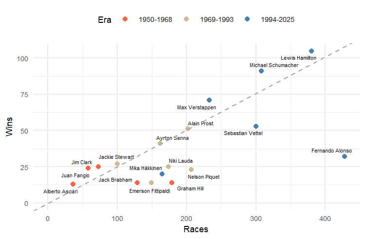

# Formula 1 Data Analysis

[](LICENSE)
[](https://www.r-project.org/)
[]()

## Highlights

- End-to-end data workflow: ingestion via a dedicated
  [ETL pipeline](https://github.com/jmr-lab/f1-etl-pipeline) (Python),
  analysis and modelling in **R** (tidyverse)
- Data quality auditing: identification and correction of inconsistencies in
  the source dataset (shared wins, disqualification edge cases, fatal-accident
  classification)
- Cross-era normalisation: handling 75+ years of rule changes (points systems,
  race counts, dropped-score rules) to enable fair driver comparisons
- Clear separation of concerns: reproducible data pipeline, documented
  methodology, and an analytical PDF report

## Sample Visualization

Wins vs. races participated (top multi-champions), colour-coded by era:



---

## Project Overview

This repository contains an ongoing exploratory data analysis (EDA) of Formula 1 World Championship data from 1950 to present, with the ultimate goal of identifying the greatest driver of all time (GOAT) using statistical methods and machine learning.

### Research Question
> *"Who is or was the best Formula 1 driver of all time?"*

This project takes a mathematical approach to evaluate driver performance across different eras, accounting for evolving rules, car technology, and competitive landscapes.

---

## Dataset

> [!WARNING]
> The current dataset contains known issues and is actively being fixed. Please refer to the companion [ETL project](https://github.com/jmr-lab/f1-etl-pipeline) for the latest version.

### Data Source

The raw data originates from [Jolpica](https://jolpica.com/f1/), a community-maintained F1 database. To ensure data quality and reproducibility, I've created a dedicated ETL pipeline in a companion repository:

- **ETL Pipeline:** [jmr-lab/f1-etl-pipeline](https://github.com/jmr-lab/f1-etl-pipeline)
- **Current Status:** Data transformation and validation in progress

| File | Description | Expected Records |
|------|-------------|------------------|
| `circuits.csv` | Circuit information | ~78 circuits |
| `drivers.csv` | Driver demographics | 864+ drivers |
| `races.csv` | Race events | 1,149+ races |
| `results.csv` | Race results per driver | Full race history |
| `driver_standings.csv` | Championship standings | Season-by-season |
| `constructors.csv` | Team information | 211 constructors |
| `constructor_standings.csv` | Team standings | Full history |
| `status.csv` | Finishing status codes | Status categories |

**Key Statistics (as of 2026):**
- 76 seasons analysed
- 1,149 total races
- 864 drivers participated
- 115 race winners
- 35 world champions

---

## Preliminary Findings

### Driver Performance Leaders

| Driver | Titles | Wins | Races | Seasons | Win/Race Ratio |
|--------|--------|------|-------|---------|----------------|
| Lewis Hamilton | 7 | 105 | 380 | 19 | 0.276 |
| Michael Schumacher | 7 | 91 | 308 | 19 | 0.295 |
| Juan Manuel Fangio | 5 | 24 | 58 | 8 | **0.414** |
| Max Verstappen | 4 | 71 | 233 | 11 | 0.305 |
| Sebastian Vettel | 4 | 53 | 300 | 16 | 0.177 |
| Alain Prost | 4 | 51 | 202 | 13 | 0.252 |
| Ayrton Senna | 3 | 41 | 162 | 11 | 0.253 |
| Jackie Stewart | 3 | 27 | 100 | 9 | 0.270 |
| Niki Lauda | 3 | 25 | 174 | 13 | 0.144 |

### Key Observations

**Era Comparisons**
- **Early Era (1950-1968)**: Fewer races per season, shorter careers, higher risk
- **Middle Era (1969-1993)**: Transitional period with rule changes
- **Modern Era (1994-present)**: More races, longer careers, advanced technology

**Efficiency Metrics**
- Fangio dominates in efficiency: 5 titles in just 8 seasons (62.5% title rate)
- Modern drivers accumulate more points due to expanded scoring systems
- Some champions won with surprisingly low win ratios (e.g., Keke Rosberg: 1/15 wins in 1982)

**Scoring Evolution**
- 1950s: 8 points for winner
- 2010+: 25 points for winner
- Only best results counted until 1990, creating championship anomalies (e.g., Senna 1988 vs Prost)

**Constructors**
| Team | Titles | Wins | First Entry |
|------|--------|------|-------------|
| Ferrari | 22 | 249 | 1950 |
| McLaren | 11 | 199 | 1968 |
| Mercedes | 9 | 131 | 1954 |
| Williams | 9 | 114 | 1975 |
| Red Bull | 6 | 130 | 2005 |

---

## Methods & Pipeline

Raw Data (Jolpica) → ETL Pipeline → Cleaned Dataset → Feature Engineering → EDA → ML Models

### Current Stage: Exploratory Data Analysis
- [x] Data acquisition via ETL pipeline
- [x] Initial data cleaning and transformation
- [x] Statistical summaries by era
- [x] Career timeline visualisations
- [ ] Dataset validation and correction (in progress)
- [ ] Normalisation across different scoring systems
- [ ] Machine learning models for driver evaluation
- [ ] Car performance adjustment factors

### Tools Used
- **R** (tidyverse, ggplot2, dplyr, tidyr)
- **RStudio** for development and analysis
- **Vega-Lite** for interactive visualisations

*Note: The companion ETL project ([f1-etl-pipeline](https://github.com/jmr-lab/f1-etl-pipeline)) uses Python for data ingestion and transformation.*

---

## Repository Structure

```
Formula-1/
├── data/
│
└── raw/             # Downloaded dataset from ETL pipeline
├── src/             # R utility functions
└── Formula1.pdf     # Detailed PDF report (WIP)
└── README.md
```

*Repository structure is currently being reorganised. Check back for updates.*

---

## Roadmap

| Phase | Goal | Status |
|-------|------|--------|
| 1 | Data collection via ETL pipeline | Complete |
| 2 | Data validation and correction | In Progress |
| 3 | Exploratory analysis | In Progress |
| 4 | Driver normalisation model | Planned |
| 5 | Car performance estimation | Planned |
| 6 | ML-based GOAT ranking | Planned |

---

## Running the Analysis

```r
# Install required packages
install.packages(c("tidyverse", "ggplot2", "janitor", "here"))

# Load the project
setwd("formula1-eda")

# Import cleaned dataset
data <- read_csv("data/raw/formula1_processed.csv")
```

## Notable Findings & Historical Context

During the EDA process, several unexpected findings emerged:

### Shared Wins
I initially assumed there was exactly one winner per race throughout F1 history. However, the data reveals **3 races where 2 drivers shared a win**, resulting in joint records for that Grand Prix.

### Disqualification Exception
Common wisdom suggests disqualified drivers forfeit all points earned. Yet **Stirling Moss** defied this convention: during the 1959 French GP, he was disqualified but retained his **1 point for fastest lap**—making him one of the rare drivers to score points despite a DQ status.

### Lowest Win-to-Title Ratio
Who won the championship with the fewest race victories? **Keke Rosberg** took the 1982 title after winning just **1 out of 15 races**. That's a **6.7% win ratio** while still securing the world championship. Interestingly, his lone victory came at the **1982 Swiss GP**, held at the **Dijon-Prenois circuit in France**.

### Why Was the Swiss GP Held in France?
Following the catastrophic **1955 Le Mans disaster** (83 fatalities), Switzerland imposed a ban on circuit racing that persists to this day. As a result, the **Swiss Grand Prix was hosted in France** (at Dijon-Prenois). This explains why Rosberg's "Swiss" victory was actually on French soil.

### Mercedes' F1 Absence & Return
Mercedes also withdrew from racing after the **1955 Le Mans disaster**, pulling out of the sport entirely until their **2010 return** as a works team. This creates a curious 56-year gap in their constructor record, yet they still rank among the most successful teams (9 titles as of 2025).

---

## Notes

> [!NOTE]
> **Preliminary conclusions** — This analysis aims to spark discussion rather than declare definitive rankings.
>
> **Context matters** — Different eras had fundamentally different challenges (safety, competition depth, car reliability).
>
> **Ongoing work** — The PDF report ([reports/Formula1.pdf](reports/Formula1.pdf)) contains detailed methodology and extended analysis.
---

## Contributing

Contributions welcome! Particularly interested in:
- Alternative normalisation methodologies
- Additional statistical approaches
- Peer review of the ML modelling pipeline
- Data validation feedback (open an issue if you spot inconsistencies)

---

## References

- [Jolpica F1 Database](https://jolpica.com/f1/)
- [F1 ETL Pipeline (Companion Repo)](https://github.com/jmr-lab/f1-etl-pipeline)
- [Formula 1 Stats Database](https://www.formula1.com/en/results.html)
- Hergé, *The Calculus Affair* (1956) - Cultural reference to Fangio's legacy

---

## License

MIT License - See LICENSE file for details

---

> "Driving like Fangio" - A timeless standard of excellence in motorsport

---

*Last updated: September 2026*
